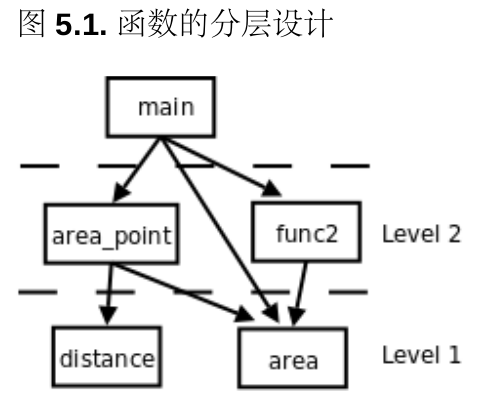
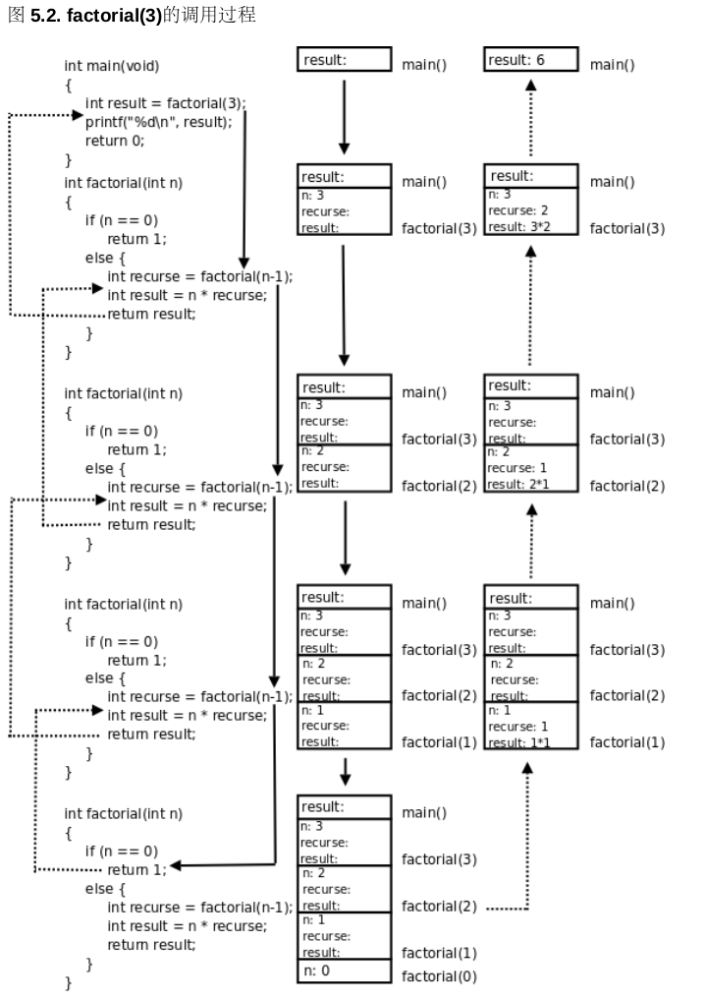

# 5 深入理解函数

## 5.1 return语句

在有返回值的函数中，return语句的作用是体重整个函数的返回值，并结束当前函数返回到调用它的地方。在没有返回值的函数中也可以使用return语句，例如当检查到一个错误是提前结束当前函数的执行并返回：

```c
#include <stdio.h>

void print_logarithm(double x)
{
    if (x <= 0.0){
        printf("Positive numbers only, please.\n");
        return;
    }
    printf("The log of x is %f", log(x));
}    
```

这个函数首先检查参数想是否大于0，如果x不大于0就打印错误提示，然后提前结束函数的执行返回到调用者，只有当x大于0时才能求对数。在打印了对数结果之后到达函数体的末尾，自然地结束执行并返回。注意，使用数学函数log需要包含头文件math.h ， 由于x是浮点数，应该与同类型的数做比较，所以写成0.0

前面定义了一个检查奇偶性的函数，如果是奇数就打印x is odd，如果是偶数就打印x is even。事实上这个函数并不十分好用，**我们定义一个检查奇偶性的函数往往不是为了打印两个字符串就完了，而是为了根据奇偶性的不同分辨执行不同的后续动作。我们可以把它改成一个返回布尔值的函数：

```c
int is_even(int x)
{
    if (x % 2 == 0)
        return 1;
    else
        return 0;
}    
```

有人喜欢写成return(1); 这种形式也可以，表达式外面套括号表示改变运算符优先级，在这里不起任何作用。我们可以这样调用这个函数：

```c
int i = 19;
if (is_even(i)) {
    /* do something */
} else {
    /* do some other thing */
}
```

**返回布尔值的函数是一类非常有用的函数，在程序中通常充当控制表达式，函数名通常带有is或if等表示判断的词，这里函数也叫做谓词(Predicate)**。is_even这个函数写的有点啰嗦，x % 2 这个表达式本来就有0值或非0值，直接把这个值单做布尔值返回就可以了：

```c
int is_even(int x)
{
	return !(x % 2);
}    
```

函数的返回值应该这样理解：**函数返回一个值相当于定义一个和返回值类型相同的临时变量并用return后面的表达式来初始化**。例如上面的函数调用相当于这样的过程：

```C
int 临时变量 = !(x % 2);
函数退出，局部变量x的存储空间释放;
if (临时变量) { /* 临时变量用完就释放*/
    /* do some thing */
} else {
    /* do some other thing */
}
```

当if语句对函数的返回值做判断时，函数已经退出，局部变量x已经释放，所以不可能在这时候才计算表达式!(x % 2)的值，表达式的值必然是事先计算好了存在一个临时变量里的，然后函数退出，局部变量释放，if语句对这个临时变量的值做判断。注意，**虽然函数的返回值可以看作是一个临时变量，但我们只是读一下的它的值，读完就释放它，而不能往它里面存新的值，换句话说，函数的返回值不是左值，或者说函数调用表达式不能做左值**，因此线面的复制语句是非法的：

```c 
is_even(20) = 1;
```

前面讲过，C语言的传参规则是Cal by Value，按值传递，现在我们直到返回值也是 按值传递的，即便返回语句写成return x; ，返回的也是变量x的值，而非变量x本身，因为变量x马上就要被释放了。

在写带有return语句的函数时要小心检查所有的代码路径(Code Path)。有些代码路径在任何条件下都执行不到，这称为Dead Code。有Dead Code就一定有Bug，你写的每一行代码都是想让程序在某种情况下去执行的，你不可能故意写出一行用于不会被执行的代码，如果程序在任何情况下都不会去执行它，说明跟你 预想的不一样，要么是i对所有可能的清理分析的不正确，也就是逻辑错误，要么就是笔误，语义错误。还有一些时候，对程序中所有可能的情况分析得不够全面将导致漏掉一些代码路径。如：

```c 
int absolute_value(int x)
{
    if (x < 0) {
        return -x;
    } else if (x > 0) {
        return x;
    }
}    
```

这个函数 被定义为返回int,就应该在任何情况下都返回int , 但上面这个程序在x==0时安静地退出函数，什么也不返回，C语言对于这种情况会返回什么结果是未定义的，通常返回不确定的值，等学到"函数调用"就明白为什么了。另外注意这个例子中把-号当负号用而不是当减号用，事实上+号也可以这么用。正负号是单目运算符，而加减好是双目运算符，正负号的优先级和逻辑非运算相同，比加减的优先级要高。

上面的代码不会产生编译错误，编译器只做语法检查和最简单的语义检查，而不检查程序的逻辑。

## 5.2 增量式开发

到你看到了很多示例代码，并在这些代码的基础上做了很多改动。但是如果从头开始编写一个程序解决某个问题，应该按什么步骤来写呢？这里提出一种增量式(Incremental)开发的思路，很适合初学者。

开发过程中如果两个函数有相同的代码，就要考虑复用(Reuse)。复用就是避免写重复的代码。封装就是为了复用，把解决各种小问题的代码封装成函数，在解决第一个大问题时可以用这些函数，在解决第二个大问题是可以复用这些函数。

解决问题的过程就是把大的问题分成小的问题，小的问题再分成更小的问题，**这个过程在代码中的体现就是函数的分层设计(Stratify)**。distance和area是两个底层函数，解决一些很小的问题，而area_point是一个上层函数，上层函数通过调用底层函数来解决更大的问题，底层和上层函数都可以被更上一层的函数调用，最终所有的函数都直接或简洁地被main函数调用。如下图所示：



## 5.3 递归

如果定义一个概念需要用到这个概念本身，我称它的定义是递归的(Recursive)

数学中有很多概念是用它自己来定义的，比如n的阶乘(Factorial)是这样定义的：n的阶乘等于n乘以n-1的阶乘。为了防止无限延伸下去，需要定义一个最关键的基础条件(Base Case)：0的阶乘等于1.

下面是一个计算阶乘的函数factorial:

```c
int factorial(int n)
{
    if (n == 0)
        return 1;
    else
    {
        int recurse = factorial(n-1);
        int result = n * recurse;
        return result;
    }
}    
```

上面代码中，当n不为0时，根据定义应该是return n*factorial(n-1). 这里为了方便分析引入几个临时变量。

以factorial(3)为例整个调用过程如下图所示：



图中用实现箭头表示调用，用虚线箭头表示返回，右侧的框表示在调用和返回过程中各层函数调用的存储空间变化情况。

看到上图中右侧存储空间的变化过程，随着函数调用的层层深入，存储空间的一端逐渐增长，然后随着函数调用的层层返回，存储空间的这一端有逐渐缩短，并且每次访问参数和局部变量时只能访问它的参数和局部变量，而不能访问factorial(3)和main()的参数和局部变量。具有这种性质的数据结构称为堆栈或栈(stack)，随着函数调用和返回而不断变化的这一端称为栈顶，每个函数调用的参数和局部变量的存储空间(上图的每个小方框)称为一个栈帧(Stack Frame)。操作系统为程序的运行预留了一块栈空间，函数调用时就在这个栈空间里分配栈帧，函数返回时就释放栈帧。

这里需要指出的是：有一个重要的结论就是递归和循环是等价的，用循环鞥做的事用递归都能做，反之亦然。事实上有的编程语言(比如某些LISP实现)只有递归而没有循环。**计算机指令能做的所有事情就是数据存取、运算、测试和分支、循环(或递归)，在计算机上运行高级语言写的程序最终也要翻译成指令，指令做不到的事情高级语言也的程序肯定也做不到**。虽然高级语言有丰富的语法特性，但也只是比指令写起来更方便而已，能做的事情是一样多的。


